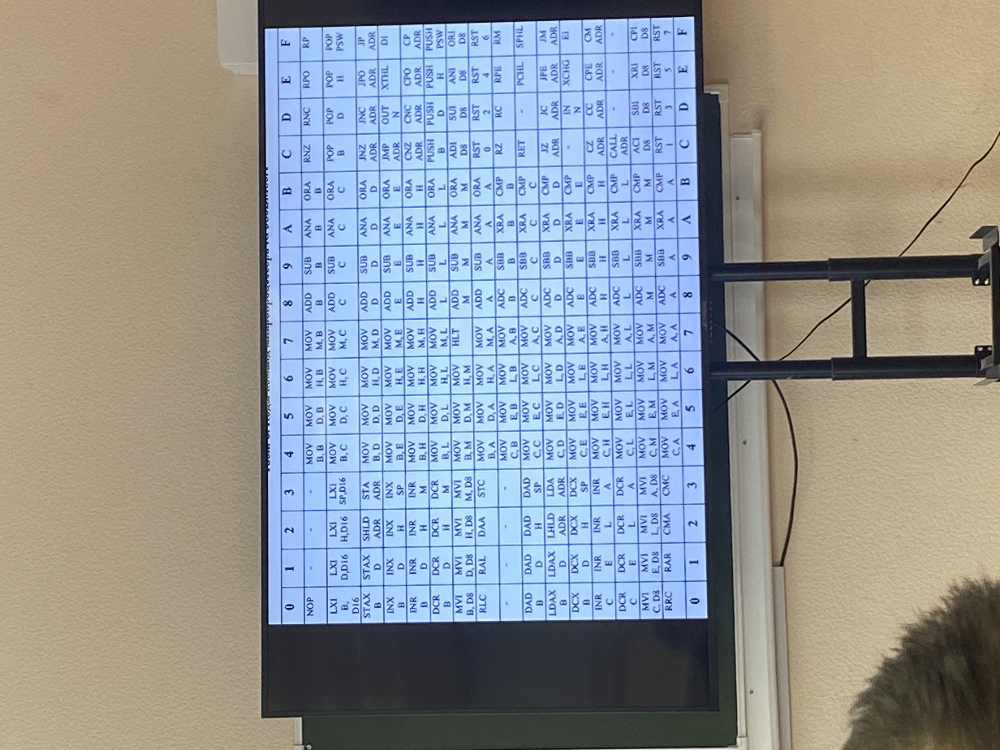
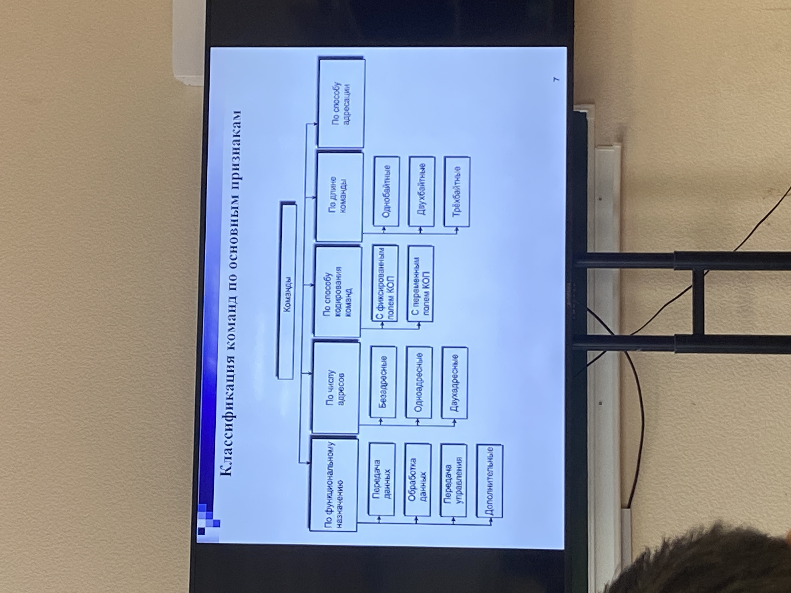

Микропроцессоры разных типов имеют свои системы команд, которые отличаются друг от друга. Чтобы решить ту или иную задачу при помощи микропроцессорной системы (любой вычислительной машины), в последнюю необходимо ввести точные, чётко сформулированные инструкции или команды. Составление такой последовательности команд, выполнив которые машина решит поставленную задачу, **является целью программирования**.

Современные вычислительные машины **не приспособлены для ввода команд**, сформулированных на естественном языке, например, на английском, русском, немецком или французском. Поэтому при работе с машиной используют один из специальных языков программирования, главное отличие которых от естественных языков состоит в **строго фиксированном грамматическом строе** и крайне ограниченном количестве используемых слов.

> :sparkles: В основе языка ЭВМ лежит язык ее вычислительного устройства — микропроцессора. Команды такого машинного языка — это коды, которые представляются комбинациями электрических импульсов.

|  |  |
|-|-|
|Классификация команд по основным признакам|Таблица кодов машинных команд и их расшифровок|

<b>Команды пересылки данных</b>

Эти команды занимают очень важное место в системе команд любого процессора. Они выполняют следующие важнейшие функции:

- загрузка (запись) содержимого во внутренние регистры процессора, сохранение в памяти содержимого внутренних регистров процессора;
- копирование содержимого из одной области памяти в другую;
- запись в устройства ввода/вывода и чтение из устройств ввода вывода.
В некоторых процессорах все эти функции выполняются одной единственной командой MOV (для байтовых пересылок - MOVB) но с различными методами адресации операндов.

<b>Арифметические команды</b>

Арифметические команды рассматривают коды операндов как числовые двоичные или двоично-десятичные коды. Эти команды могут быть разделены на пять основных групп:

- команды операций с фиксированной запятой (сложение, вычитание, умножение, деление);
- команды операций с плавающей запятой (сложение, вычитание, умножение, деление);
- команды очистки;
- команды инкремента и декремента;
- команда сравнения.

Команды операций с фиксированной запятой работают с кодами в регистрах процессора или в памяти как с обычными двоичными кодами. Команды операций с плавающей запятой (точкой) используют формат представления чисел с порядком и мантиссой (обычно эти числа занимают две последовательные ячейки памяти). В современных мощных процессорах набор команд с плавающей запятой не ограничивается только четырьмя арифметическими действиями, а содержит и множество других более сложных команд. Например, вычисление тригонометрических функций, логарифмических функций, а также сложных функций, необходимых при обработке звука и изображения.

Команды очистки предназначены для записи нулевого кода в регистр или ячейку памяти. Эти команды могут быть заменены командами пересылки нулевого кода, но специальные команды очистки обычно выполняются быстрее, чем команды пересылки.

Команды инкремента (увеличения на единицу) и декремента (уменьшения на единицу) также бывают очень удобны. Их можно в принципе заменить командами суммирования с единицей или вычитания единицы, но инкремент и декремент выполняются быстрее, чем суммирование и вычитание. Эти команды требуют одного входного операнда, который одновременно является и выходным операндом.

Логические команды

> :bulb: Выполняют над операндами логические (побитовые) операции, то есть они рассматривают коды операндов не как единое число, а как набор отдельных битов. Этим они отличаются от арифметических команд. Логические команды выполняют следующие основные операции:

- логическое И, логическое ИЛИ, сложение по модулю (исключающее ИЛИ);
- логические, арифметические и циклические сдвиги;
- проверка битов и операндов;
- установка и очистка битов (флагов) регистра состояния процессора (PSW).

Команды логических операций позволяют побитно вычислять основные логические функции от двух входных операндов. Кроме того, операция И используется для принудительной очистки заданных битов (в качестве одного из операндов при этом используется код маски, в котором разряды, требующие очистки, установлены в нуль).

Операция ИЛИ применяется для принудительной установки заданных битов (в качестве одного из операндов при этом используется код маски, в котором разряды, требующие установки в единицу, равны единице). Операция «Исключающее ИЛИ» используется для инверсии заданных битов (в качестве одного из операндов при этом применяется код маски, в котором биты, подлежащие инверсии, установлены в единицу). Команды требуют двух входных операндов и формируют один выходной операнд.

Команды сдвигов позволяют побитно сдвигать код операнда вправо (в сторону младших разрядов) или влево (в сторону старших разрядов). Тип сдвига (логический, арифметический или циклический) определяет, каково будет новое значение старшего бита (при сдвиге вправо) или младшего бита при сдвиге влево), а также определяет, будет ли где-то сохранено прежнее значение старшего бита (при сдвиге влево) или младшего бита (при сдвиге вправо). 

Циклические сдвиги позволяют сдвигать биты кода операнда по кругу по часовой стрелке при сдвиге вправо или против часовой стрелки при едвиге влево). При этом в кольцо сдвига может входить или не входить флаг переноса. В бит флага переноса (если он используется) записывается значение старшего бита при циклическом сдвиге влево и младшего бита при циклическом сдвиго вправо. 

Соответственно, значение бита флага переноса будет переписываться в младший разряд при циклическом сдвиге влево и в старший разряд при циклическом сдвиге вправо.

